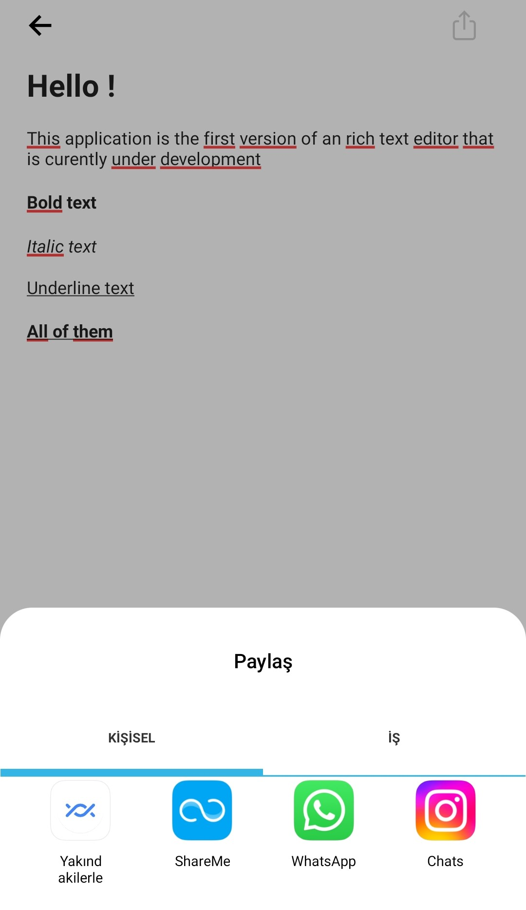

# ReactNativeTextEditor V1
---

---

Uygulama resimlerde görüldüğü gibidir. Seçilen metinlere bold, italic ve underline stilleri ekleyebilirsiniz. Tüm metnin yazı boyutunuda ayarlayabilirsiniz. Stil barı klavye ile beraber açılır ve kapanır.
Bunlara ek olarak en üstteki paylaş butonu ile yazınızı diğer uygulamalarla paylaşabilirsiniz.

---

The application is as seen in the pictures. You can add bold, italic, and underline styles to selected texts. You can also adjust the font size of the entire text. The style bar opens and closes with the keyboard.
In addition, you can share your text with other applications using the share button at the top.

